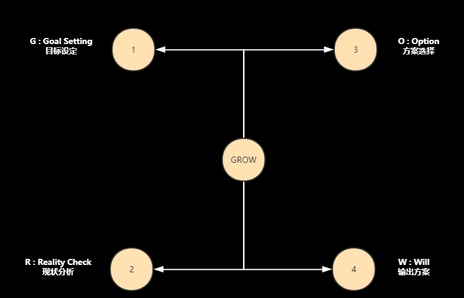

**高效团队常常面对的问题,也是问题的表象**

1. **缺乏得力人才**
   1. 怎样提升能力
2. **团队缺乏积极性**
   1. 为什么缺乏积极性
3. **预期目标达不到**
4. **管人辛苦，人才流失**
5. **团队缺乏协作**
   1. 什么原因，缺乏协作

**打造高效团队三步**

1. **做什么**
   1. 不晓得公司目标，部门目标，个人目标和任务。
   2. 不晓得目标导致不能纵横协作，不能力出一孔。
2. **怎么做**
   1. 成员能力缺乏，导致达不到目标
3. **为什么做**
   1. 激励什么
   2. 怎么激励

**三步认真拆解**

1. **做什么**
   1. **使用目标管理法MBO,KPI,OKR等，统一思想。通过以下两种方式了解情况。**
      1. **正式访谈-高管，核心人员，会议室访谈**
         1. 业务状况
         2. 管理状况
         3. 组织状况
         4. 每个人心里状况
      2. **非正式访谈-休闲时间不经意的问问题，核心三问题**
         1. 你知道你这个季度你主要的工作目标和任务是什么吗？
         2. 你知道你部门这个季度的主要目标和任务是什么吗？
         3. 你知道你公司这个季度的主要目标和任务是什么吗？
   2. **目标的管理是管理的第一核心**
      1. **目标管理三个问题**
         1. 目标如何来，目标是否正确-解决做正确事情问题
         2. 目标如何做到正解的传导-解决目标贯彻的问题
         3. 目标如何做到横向对齐-解决团队协作问题
   
2. **怎么做**

   1. **有了目标，需要有能力的人完成。**

      1. 组织能力

         1. 解决组织能力用机制和流程管理方式。
         2. 使用敏捷机制建立团队，有效快速响应。

      2. 个人能力：使用能力素质模型评估入职人员

         1. 硬性技能

            1. 专业程度-通过培训解决

         2. 软性技能

            1. 责任意识
            2. 自我解决问题能力-grow模型-辅助能力提升模型

            

3. **为什么做:做了有什么好处**

   1. 激励什么
      1. 物质激励
         1. 固定薪酬（工资）
         2. 浮动薪酬（绩效）
         3. 短期：奖金，提成
         4. 长期：股权，期权
      2. 非物质激励
         1. 事情本身的意义，愿景使命
         2. 个人职业发展机会
         3. 有挑战性的工作内容
      3. 即时激励
         1. 被认可和关注